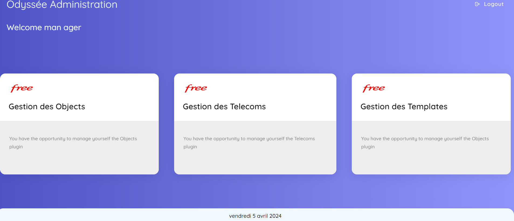
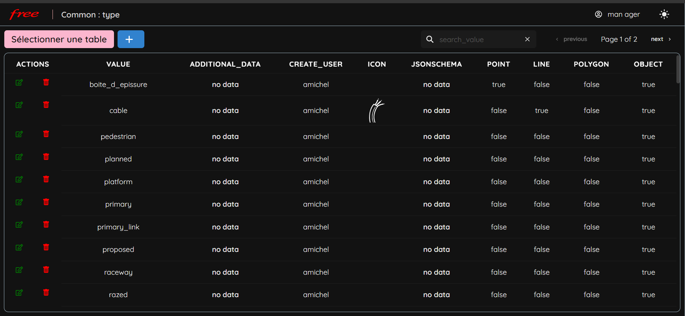
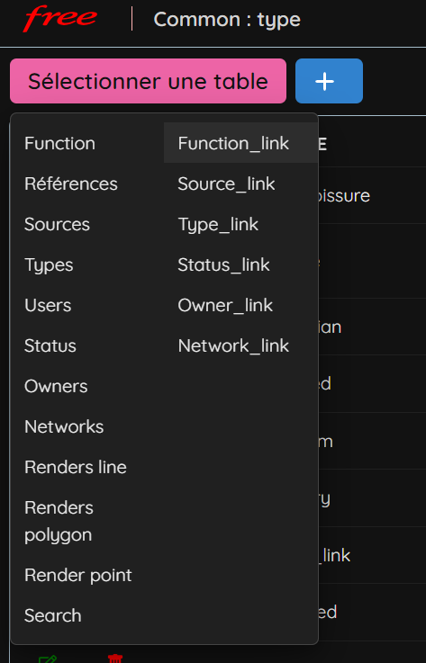
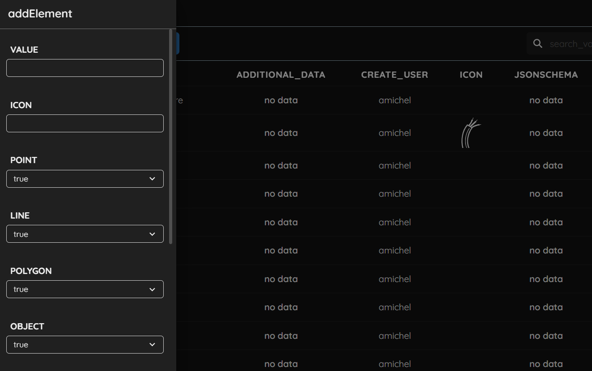
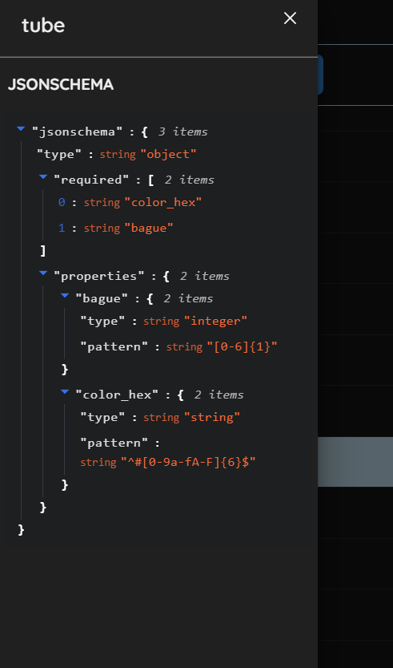

# Odyssée-Admin
 - Outil d'administration pour la gestion d'infrastructure

## Dependencies
- chakra-ui/react
- microlink/react-json-view
- framer-motion
- keycloak-js
- react-router-dom
- zustand

## ScreenShot

